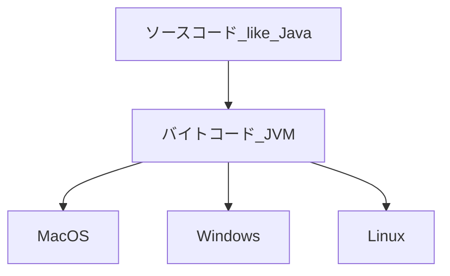

# JVM言語とは？

JVM(= Java Virtual Machine)の略称

## JVMの働き

1. ソースコードをJavaのコンパイラを通して、「バイトコード」と呼ばれる中間コードに変換
2. バイトコードは、JVMによってそれぞれのOSにあった機械語に翻訳

つまり、JVMがOSの違いを吸収するクッション材となってくれているのです。
このように、Javaの実行環境は、間にJVMが挟まっているという点が特徴的です。

## JVMのメリット/デメリット
- メリット
  - マルチプラットフォーム：OSに依存せずに動作する
    - Windows用のJVMは、WindowsOSが実行できるような機械語に変換
    - mac用のJVMは、macOSが実行できるような機械語に変換
    - Linux用のJVMは、LinuxOSが実行できるような機械語に変換
- デメリット
  - 実行速度が若干遅い、メモリを使う
    - C,C++などの完全なコンパイラ型の言語に比べると実行速度やメモリの面で性能が劣る

## JVM言語: 例
- Java
- Kotlin
- Groovy
- Jython
- JRuby